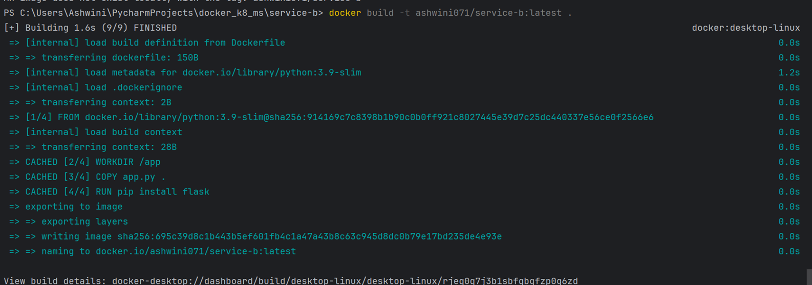
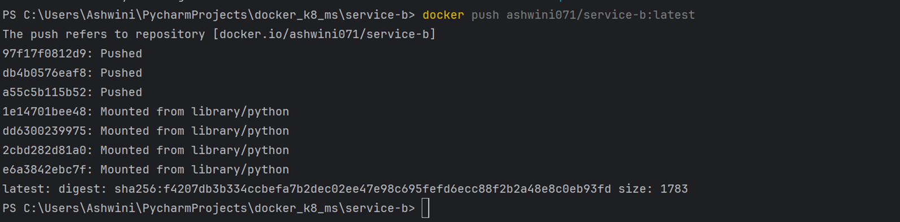
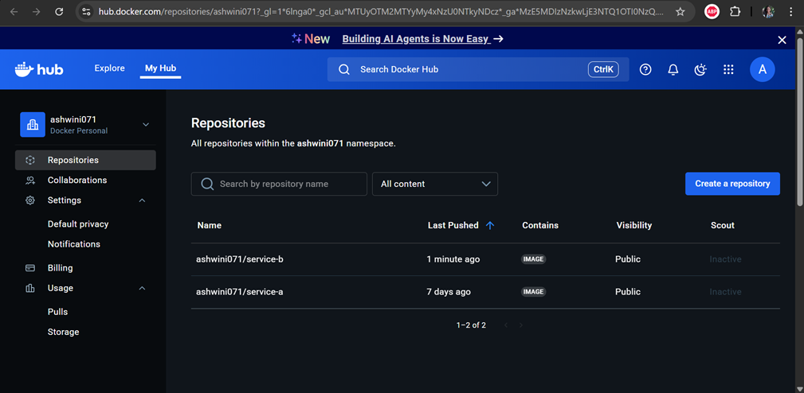
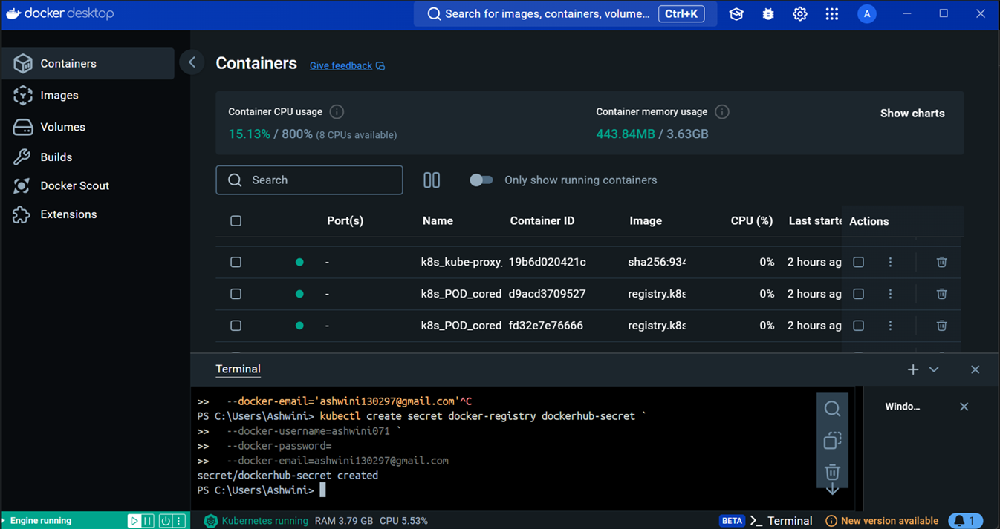
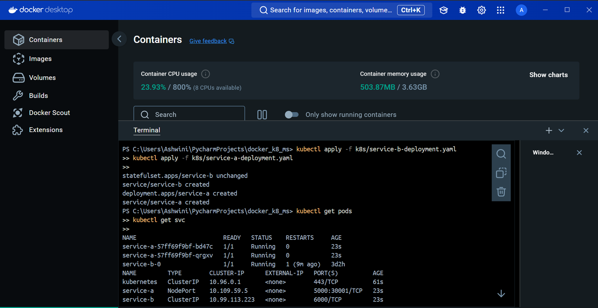
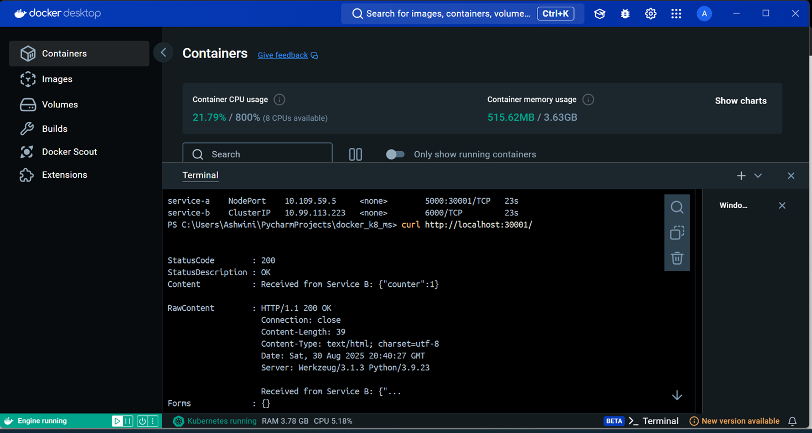
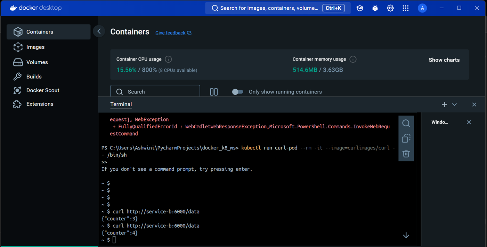

# 🚀 Docker + Kubernetes Microservices Project  

This project demonstrates deploying **two microservices** (Flask apps) on **Kubernetes**, using **Docker** for containerization, a **private Docker Hub registry** with Kubernetes secrets, and inter-service communication inside the cluster.  

---

## 📌 Project Overview  

- **Service A**: A Flask app that calls **Service B**.  
- **Service B**: A Flask app (stateful) that returns some data.  
- **Private Image Pull**: Service B’s image is stored in a **private Docker Hub repo**, requiring a **Kubernetes secret** for access.  
- **Networking**: Services communicate internally over Kubernetes Service DNS (`service-b:6000`).  
- **Scalability**: Controlled using **ReplicationControllers/ReplicaSets**.  

---


---

## ⚙️ Tech Stack  

- **Python + Flask** → Microservices  
- **Docker** → Containerization  
- **Docker Hub (Private/Public)** → Image storage  
- **Kubernetes (Minikube / GKE)** → Orchestration  
- **K8s Secrets** → Private registry authentication  

---

## 🐳 Step 1: Build and Push Docker Images  

```bash
# Service A
cd service-a
docker build -t ashwini071/service-a:latest .
docker push ashwini071/service-a:latest
```

```bash
# Service B
cd ../service-b
docker build -t ashwini071/service-b:latest .
docker push ashwini071/service-b:latest
```




👉 Ensure Service B repo is private on Docker Hub.



## 🔑 Step 2: Create Kubernetes Secret for Private Registry

Use Personal Access Token create in dockerhub instead of actual password!
```shell
kubectl create secret docker-registry dockerhub-secret \
  --docker-username=<your_dockerhub_username> \
  --docker-password=<your_dockerhub_token> \
  --docker-email=<your_dockerhub_email>
```

## ☸️ Step 3: Deploy to Kubernetes

```shell
kubectl apply -f k8s/service-b-deployment.yaml  
kubectl apply -f k8s/service-a-deployment.yaml
```

## 🌐 Step 4: Access Services

Service A → Exposed via NodePort / LoadBalancer <br>
Service B → ClusterIP (internal only)

Check Service A:





Check if service-b is accessible via internal network by creating a dummy pod:


